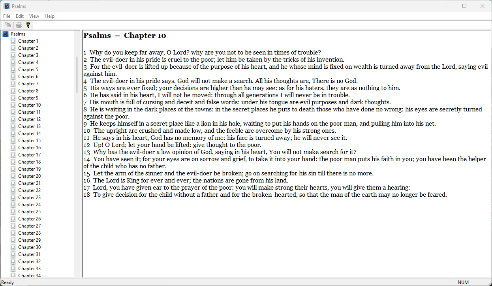

# Mika's Bible App

A Windows desktop Bible reading application built with MFC (Microsoft Foundation Classes) and C++.  
All 66 books of the Bible are available in the *Bible in Basic English* (BBE) translation.

> **"Jesus is Lord!"**

---

## Screenshot



---

## Features

- Full Bible text – 66 books, 31 102 verses (Bible in Basic English)
- Tree-view navigation: expand any book to browse its chapters
- Fast chapter loading via SQL Server LocalDB backend
- Read-only rich-text display with Georgia font
- **Copy** any selected text to the clipboard (Ctrl+C / Edit > Copy)
- **Print** the current chapter (Ctrl+P / File > Print)
- Title bar shows the name of the currently selected book
- English CHM help file (Help > Help Topics or F1)
- Custom book and chapter icons in the navigation tree

---

## Prerequisites

| Component | Where to get it |
|-----------|----------------|
| Windows 10 x64 or later | — |
| Visual Studio 2022 (v143 toolset) or later | [visualstudio.microsoft.com](https://visualstudio.microsoft.com/) |
| SQL Server Express LocalDB 2019+ | Bundled with VS, or [aka.ms/sqllocaldb](https://aka.ms/sqllocaldb) |
| HTML Help Workshop *(to build CHM)* | [Microsoft download](https://learn.microsoft.com/en-us/previous-versions/windows/desktop/htmlhelp/microsoft-html-help-downloads) |
| Inno Setup 6 *(to build installer)* | [jrsoftware.org/isinfo.php](https://jrsoftware.org/isinfo.php) |

---

## Getting Started

### 1. Clone the repository

```bash
git clone https://github.com/mphuttu/MikasBibleApp.git
cd MikasBibleApp
```

### 2. Set up the database

Open **PowerShell** in the repository root and run:

```powershell
.\ImportBible.ps1
```

This creates the `BibleDB` LocalDB database and imports all verses from `data\bbe.txt`.  
To force a clean reimport: `.\ImportBible.ps1 -Force`

### 3. Build the application

Open `MikasBibleApp.slnx` in Visual Studio 2022 and build in **x64 | Debug** or **x64 | Release**.

### 4. Build the help file *(optional)*

```bat
cd help
build_help.bat
```

Copy the resulting `help\MikasBibleApp.chm` to the same directory as `MikasBibleApp.exe`.

### 5. Run

Launch `x64\Release\MikasBibleApp.exe` (or press F5 in Visual Studio).

---

## Project Structure

```
MikasBibleApp/
├── data/
│   └── bbe.txt                  # Bible in Basic English source text
├── help/
│   ├── MikasBibleApp.hhp        # HTML Help project
│   ├── toc.hhc                  # Table of contents
│   ├── index.hhk                # Help index
│   ├── build_help.bat           # Build script for CHM
│   └── html/                   # Help HTML pages
├── res/
│   ├── BibleBookIcon.ico        # Tree view book icon
│   └── BibleChapterIcon.ico     # Tree view chapter icon
├── setup/
│   ├── MikasBibleApp.iss              # Inno Setup — full install (imports DB)
│   └── MikasBibleApp_ExistingDB.iss   # Inno Setup — app only (DB already exists)
├── BibleDatabase.h / .cpp       # ODBC wrapper for LocalDB
├── ContentsView.h / .cpp        # Left-panel tree view
├── MainFrm.h / .cpp             # SDI main frame + splitter
├── MikasBibleApp.h / .cpp       # Application class
├── MikasBibleAppDoc.h / .cpp    # Document class (DB + selection state)
├── MikasBibleAppView.h / .cpp   # Right-panel rich-edit view
├── ImportBible.ps1              # Database import script
└── README.md
```

---

## Keyboard Shortcuts

| Key | Action |
|-----|--------|
| Ctrl+C | Copy selected text |
| Ctrl+A | Select all text in chapter |
| Ctrl+P | Print current chapter |
| F1 | Open Help |

---

## Building the Installer

Requires [Inno Setup 6](https://jrsoftware.org/isinfo.php).  
Two installer scripts are provided in `setup\`:

### Option A — Full installation (new machine, no database yet)

Use `setup\MikasBibleApp.iss`.

This installer:
- Installs the application executable, help file, and tree-view icons
- Installs the VC++ 2022 x64 Redistributable and SQL Server LocalDB (if not present)
- Copies `ImportBible.ps1` and `data\bbe.txt` to the application folder
- Runs `ImportBible.ps1` automatically to create the `BibleDB` LocalDB database

Additional files needed in `setup\` before compiling:
- `VC_redist.x64.exe` — [aka.ms/vs/17/release/vc_redist.x64.exe](https://aka.ms/vs/17/release/vc_redist.x64.exe)
- `SqlLocalDB.msi` — [aka.ms/sqllocaldb](https://aka.ms/sqllocaldb)

Output: `setup\Output\MikasBibleAppSetup.exe`

### Option B — Application-only installation (BibleDB already exists)

Use `setup\MikasBibleApp_ExistingDB.iss`.

This installer:
- Installs the application executable, help file, and tree-view icons
- Installs the VC++ 2022 x64 Redistributable (if not present)
- Does **not** include the database import script or Bible data
- Assumes `BibleDB` already exists in SQL Server LocalDB on the target machine

Additional files needed in `setup\` before compiling:
- `VC_redist.x64.exe` — [aka.ms/vs/17/release/vc_redist.x64.exe](https://aka.ms/vs/17/release/vc_redist.x64.exe)

Output: `setup\Output\MikasBibleAppSetup_ExistingDB.exe`

### Steps (both variants)

1. Build the project in **Release** configuration.
2. Build the CHM help file (see above).
3. Place the required prerequisite installer(s) in `setup\` (see above).
4. Open the desired `.iss` file in Inno Setup and click **Build > Compile**.

---

## License & Copyright

Copyright © Mika Huttunen, 2026.  
Jesus is Lord!

The *Bible in Basic English* (BBE) translation is in the public domain.

---

## Changelog

### v1.0.2 — 2026-05-21

#### Installer
- **Second installer script** `setup\MikasBibleApp_ExistingDB.iss` added for machines
  where `BibleDB` already exists in LocalDB — installs only the executable, help file,
  and tree-view icons (no database import, no LocalDB/data files bundled).
- **CHM included correctly** — removed a `Check: FileExists(...)` guard that was
  evaluated on the target machine at runtime, causing the help file to be silently
  skipped during installation.

#### Bug fixes
- **Tree-view icons in installed build** — `ContentsView.cpp` now first looks for
  `res\` next to the executable (`{app}\res\`), then falls back to the
  development-time path (`exe\..\..\res\`). Icons are visible in both the
  installed application and Visual Studio debug/release runs.

---

### v1.0.1 — 2026-05-20

#### Bug fixes
- **Ctrl+C copy now works** — the reading pane forwards keyboard focus to the
  `CRichEditCtrl` child; explicit `ID_EDIT_COPY` command handler added so
  Edit > Copy and Ctrl+C are always active when text is selected.
- **Correct book names in the contents tree** — six book abbreviations used in
  `bbe.txt` were missing from the import mapping:

  | Abbreviation | Correct name     |
  |---|---|
  | `Jug` | Judges |
  | `Psm` | Psalms |
  | `Mak` | Mark |
  | `Phl` | Philippians |
  | `1Ts` | 1 Thessalonians |
  | `2Ts` | 2 Thessalonians |

  `ImportBible.ps1` updated; live database corrected with SQL `UPDATE`.

#### UI / menu clean-up
- **File menu** — New, Open, Save and Save As removed (app is a read-only
  viewer; no file operations are needed).
- **Toolbar** — Save button removed in addition to the previously removed
  New / Open / Cut / Paste buttons.

#### Help system
- **Help Topics menu item** — *Help > Help Topics* (and F1) now opens
  `MikasBibleApp.chm` directly via the `HtmlHelp()` API.  
  The item is always enabled; a friendly message box is shown if the CHM is
  not found next to the executable.
- **CHM compiled** — `help/MikasBibleApp.chm` built with HTML Help Workshop
  4.74 from four HTML pages (Introduction, Overview, Navigating, Database Setup).
  XML declarations removed from `toc.hhc` / `index.hhk` to eliminate compiler
  warnings.

#### About dialog
- Duplicate auto-generated *"Copyright (C) 2026"* line (pulled from the
  VERSIONINFO resource) is now hidden at runtime.
- Custom *"Copyright © Mika Huttunen, 2026 / Jesus is Lord!"* text is
  displayed at the bottom of the dialog.

